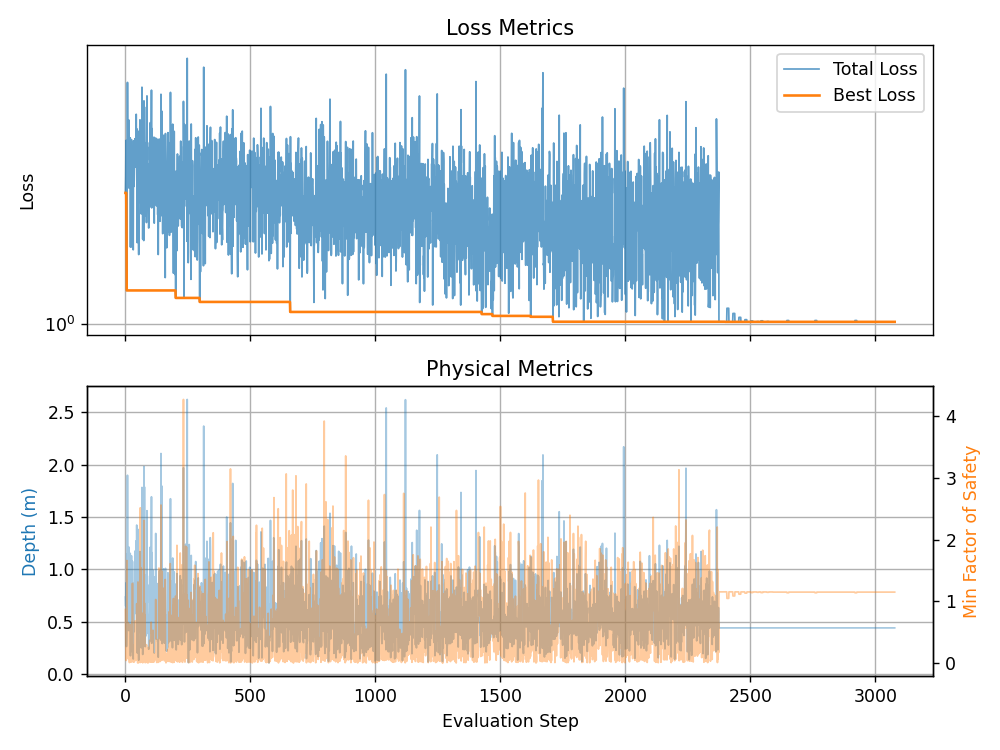
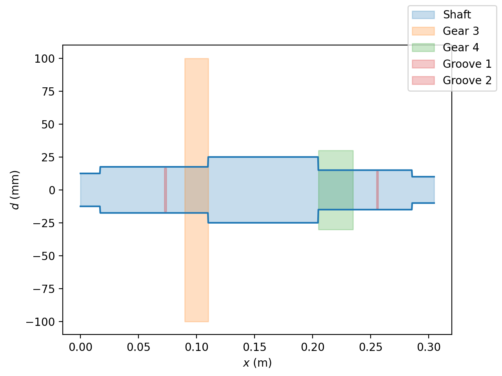
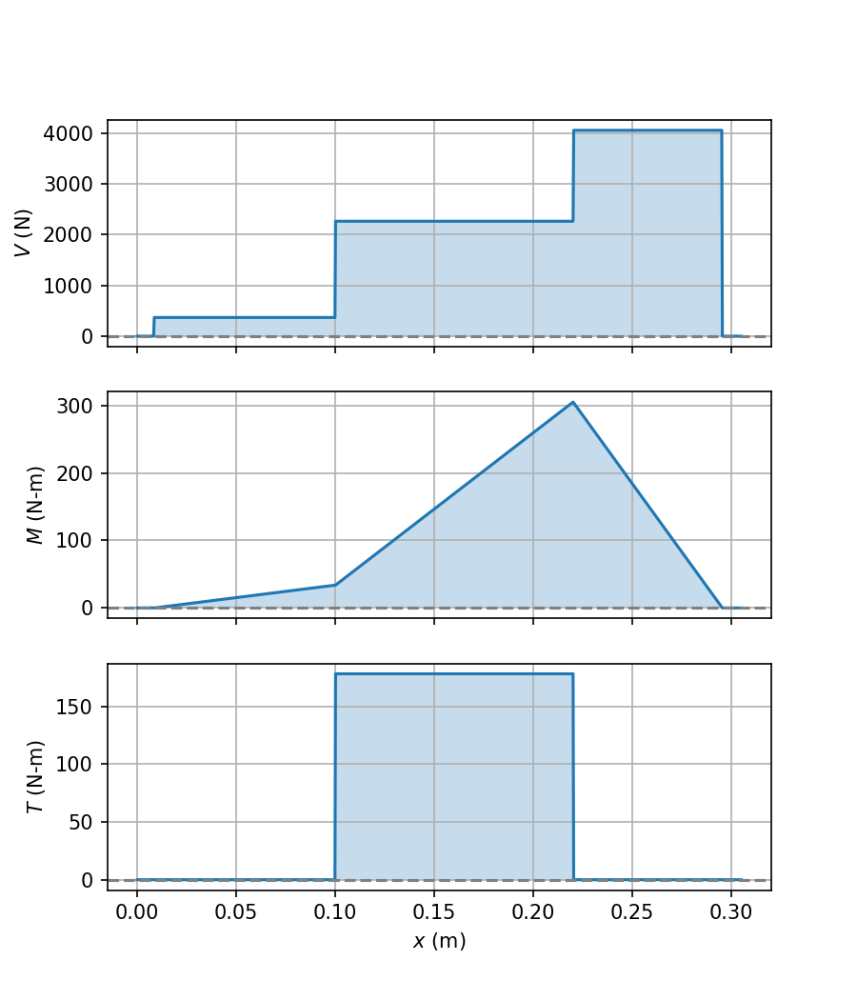

# Two-Stage Gearbox Design and Optimization

Analysis and optimization model for a two-stage spur-gear reduction gearbox. The design converts a 10,000 rpm, 50 hp input to a 500 rpm output (a 20:1 overall reduction) while sizing and checking the gears, intermediate shaft, bearings, keys, retaining rings, and stress-concentration features.

The model combines AGMA-style gear calculations, shaft statics and fatigue analysis, catalog component data, and a mixed discrete/continuous optimization. It also exports figures, LaTeX tables for the project report, and an Excel parameter sheet for the CAD model.

## Design snapshot

The committed output files describe a manually selected 5:1 first stage and 4:1 second stage with the following headline values:

| Quantity | Value |
|---|---:|
| Input speed | 10,000 rpm |
| Output speed | 500 rpm |
| Power | 50 hp (37.285 kW) |
| Overall ratio | 20:1 |
| Intermediate-shaft length | 304.8 mm |
| Stage 1 gears | 20/100 teeth, module 2 mm |
| Stage 2 gears | 20/80 teeth, module 3 mm |
| Calculated gearbox depth | 425 mm |
| Critical recorded factor of safety | 1.002, stage 2 pinion bending |

## Setup

**Python 3.10+ recommended.** (Python 3.11.4 used for development)

Create virtual environment with venv, virtualenv, uv, or conda, etc:
```bash
python -m venv .venv
```

Install dependencies:
```bash
pip install -r requirements.txt
```

Open `project_v2.ipynb` in an editor with Jupyter support and select the new environment as its kernel. Run commands from the repository root. `parts.py` resolves `Tables/`, `Figures/`, `Output_Tables/`, `Variables.xlsx`, and `Parameters.xlsx` relative to the current working directory.

## Usage

### Evaluate and export the selected design

Run the cells in `project_v2.ipynb` from top to bottom. The notebook:

1. Loads the component models and reference-table interpolators.
2. Recreates the reference plots in `Figures/`.
3. Evaluates a saved normalized optimizer vector.
4. Evaluates the final manually specified gearbox.
5. Exports `Parameters.xlsx`, the component tables in `Output_Tables/`, and the shaft diagrams in `Figures/`.

Edit the `manual_kwargs` dictionary in the notebook to evaluate another explicit design. Units are noted beside its values.

### Run the optimizer

```bash
python project_optimizer.py
```

The optimizer uses SciPy's stochastic, population-based [`differential_evolution`](https://docs.scipy.org/doc/scipy-1.17.1/reference/generated/scipy.optimize.differential_evolution.html) solver over the bounds in `Variables.xlsx`.[^scipy-de] List-valued discrete variables, including gear ratio, module, and pressure angle, are represented as integer indices into predefined arrays. The remaining discrete variables are also integral, while continuous variables are normalized automatically for numerical stability. The Boolean `Discrete?` column is passed to SciPy through the solver's `integrality` argument, so the evolutionary search and polishing step preserve valid integer coordinates.

#### Optimized variables

| Design variable | Encoded optimizer name | Description | `integrality` |
|---|---|---|:---:|
| `gear_ratio_1` | `gear_ratio_idx_1` | Stage 1 gear ratio, selected from $[2, 4, 5, 10]$. The stage 2 ratio follows from the required 20:1 overall ratio. | `True` (list index) |
| `module_1` | `module_idx_1` | Stage 1 metric gear module, selected in mm from $[0.5, 0.8, 1, 1.5, 2, 2.5, 3, 4, 5, 6]$. | `True` (list index) |
| `module_2` | `module_idx_2` | Stage 2 metric gear module, selected in mm from the same predefined module list. | `True` (list index) |
| `phi_1` | `phi_idx_1` | Stage 1 pressure angle, selected from $[14.5^\circ, 20^\circ]$. | `True` (list index) |
| `phi_2` | `phi_idx_2` | Stage 2 pressure angle, selected from $[14.5^\circ, 20^\circ]$. | `True` (list index) |
| `N_2` | `N_2_minus_min` | Number of teeth on the stage 1 pinion (gear 2), encoded as an integer offset from the minimum interference-free tooth count. | `True` (integer offset) |
| `N_4` | `N_4_minus_min` | Number of teeth on the stage 2 pinion (gear 4), encoded as an integer offset from the minimum interference-free tooth count. | `True` (integer offset) |
| `F_1` | `F_1_over_module_1` | Stage 1 face width, represented as a continuous multiple of module 1 between $3\pi$ and $5\pi$. | `False` |
| `F_2` | `F_2_over_module_2` | Stage 2 face width, represented as a continuous multiple of module 2 between $3\pi$ and $5\pi$. | `False` |
| `L_1` | `L_1_over_L` | Stage 1 gear location along the intermediate shaft, represented as a continuous fraction of shaft length $L$. | `False` |
| `L_2` | `L_2_over_L` | Stage 2 gear location along the intermediate shaft, represented as a continuous fraction of shaft length $L$. | `False` |
| `d_shaft_gear_1` | `d_shaft_gear_1` | Nominal gear bore and shaft diameter at the stage 1 gear seat, in mm. | `False` |
| `d_shaft_gear_2` | `d_shaft_gear_2` | Nominal gear bore and shaft diameter at the stage 2 gear seat, in mm. | `False` |
| `d_shaft_shoulder` | `d_shaft_shoulder_over_max_d_shaft_gear` | Shoulder diameter, represented as a continuous multiple of the larger gear-seat shaft diameter. | `False` |

`True` means SciPy restricts the encoded coordinate to integer values. For list-valued variables, that integer selects an entry from the corresponding allowed-value array; it is not the physical value itself.

For candidate design vector $\mathbf{x}$, `project_optimizer.py` minimizes the implemented loss

$$
\mathcal{L}(\mathbf{x})
= 2.25D_m
+ \max\!\left(0,\,1.1-n_{\min}\right)
- 10^{-4}n_{\mathrm{median}}
+ 10^{-3}F_{R,\max,\mathrm{kN}},
$$

where $D_m$ is gearbox height in meters, $n_{\min}$ and $n_{\mathrm{median}}$ are the minimum and median component factors of safety, and $F_{R,\max,\mathrm{kN}}$ is the larger required bearing dynamic load rating in kilonewtons. Lower loss is better: the first and fourth terms penalize package depth and bearing demand, the hinge term penalizes only a minimum factor of safety below the 1.1 target, and the small negative term rewards designs with a higher median factor of safety.

During a run the optimizer overwrites `Tables/history.csv`; when complete, it prints the best normalized design vector and saves `Figures/Iterations.png`.



Copy a promising printed vector into the notebook's `x` variable to inspect its detailed safety factors and geometry. Optimization is CPU-intensive and uses multiprocessing through `workers=os.cpu_count() - 4`.

> **Generated-file note:** importing `parts.py` immediately rewrites `Output_Tables/system_parameters.tex`, all four optimization-variable CSV/Markdown pairs, and `app.log` (ignored by Git). Notebook and optimizer runs overwrite additional tracked outputs. Review `git diff` after running either workflow.

## Model organization

`parts.py` contains the engineering model:

| Type | Responsibility |
|---|---|
| `TableInterpolator` | Wraps SciPy's `CloughTocher2DInterpolator` with a `NearestNDInterpolator` fallback for robust out-of-hull lookups on digitized Shigley chart data: Tables A-15-8, A-15-9, A-15-16, A-15-17, and Fig. 14-6.[^shigley] |
| `Material` | Stores strength/hardness data and calculates corrected endurance strength. |
| `Gear` | Computes the AGMA gear factors (`K_v`, `K_H`, `C_pf`, `C_ma`, `Y_N`, `Z_N`, `Y_J`, `Z_I`, and related terms) directly from the equations and digitized data presented in Shigley, then calculates bending/contact stresses and factors of safety.[^shigley] |
| `GearTrain` | Couples a pinion and gear and determines ratio, speed, torque, forces, and pitch-line velocity. |
| `RetainingRing` | Selects nearby catalog ring geometry and interpolates groove stress-concentration factors. |
| `Key` | Sizes/checks keys for shear and crushing. |
| `Bearing` | Converts applied reaction and desired life into the required catalog dynamic load rating. |
| `Shaft` | Uses `sympy.physics.continuum_mechanics.beam.Beam` to construct symbolic shear-force and bending-moment functions, then `lambdify`s the expressions for fast numerical evaluation at arbitrary shaft cross-sections $x$. It also plots the diagrams and checks fatigue/yield at discontinuities. |
| `Gearbox` | Builds both stages and the shaft, aggregates all factors of safety, computes package depth, and exports report/CAD data. |

The main assumptions and system constants—including power, speeds, desired life, materials, reliability, and target factor of safety—are defined near the top of `parts.py`. Optimization variables and bounds are maintained separately in `Variables.xlsx`.

## Repository contents

### Source, configuration, and workbooks

| File | Description |
|---|---|
| `README.md` | Project overview, setup and usage instructions, model notes, and this tracked-file inventory. |
| `parts.py` | Core gearbox, gear, shaft, bearing, key, retaining-ring, interpolation, safety-factor, plotting, and export implementation. |
| `project_optimizer.py` | Differential-evolution objective, evaluation-history logging, and convergence plotting entry point. |
| `project_v2.ipynb` | Interactive design evaluation, selected-vector inspection, final manual design, CAD export, table export, and plot generation. |
| `requirements.txt` | Python runtime dependencies pinned to the versions used by the current environment. |
| `Variables.xlsx` | Fourteen optimizer variables, discrete/list flags, physical bounds, normalized bounds, units, and notes. This is an input to `parts.py`. |
| `Parameters.xlsx` | CAD-facing shaft parameters exported by `Gearbox.export_CAD_parameters()` in millimeters. |

### Reference data in `Tables/`

| File | Description |
|---|---|
| `Tables/A-15-8.csv` | Digitized shoulder-fillet torsional stress-concentration data (`Kts`) versus radius and diameter ratios. |
| `Tables/A-15-9.csv` | Digitized shoulder-fillet bending stress-concentration data (`Kt`) versus radius and diameter ratios. |
| `Tables/A-15-16.csv` | Digitized retaining-ring groove bending stress-concentration data (`Kt`). |
| `Tables/A-15-17.csv` | Digitized retaining-ring groove torsional stress-concentration data (`Kts`). |
| `Tables/Fig_14-6.csv` | Digitized gear bending geometry factor `J` by desired and mating tooth counts. |
| `Tables/Table_14-2.csv` | Gear tooth count versus Lewis form factor `Y`. |
| `Tables/Table_7-6.csv` | Standard square/rectangular key dimensions by shaft diameter. Fractional values are converted to floats when loaded. |
| `Tables/Misumi_Retaining_Rings.csv` | MISUMI external retaining-ring dimensions and tolerances. |
| `Tables/McMaster_Retaining_Rings.xlsx` | Original McMaster-Carr retaining-ring catalog worksheet. |
| `Tables/McMaster_Retaining_Rings.csv` | CSV version of the McMaster-Carr catalog data used by the model. |
| `Tables/var_unit_map.csv` | Maps Python attribute names to LaTeX labels and engineering units for exported report tables. |
| `Tables/history.csv` | Per-evaluation optimizer history: critical check name, depth in meters, minimum factor of safety, and total loss. Regenerated by `project_optimizer.py`. |

The `A-15-*`, `Fig_14-6`, `Table_14-2`, and `Table_7-6` names follow the source figure/table identifiers used in the analysis code.

### Generated figures in `Figures/`

| File | Description |
|---|---|
| `Figures/A-15-8.png` | Interpolated shoulder-fillet torsional stress-concentration chart. |
| `Figures/A-15-9.png` | Interpolated shoulder-fillet bending stress-concentration chart. |
| `Figures/A-15-16.png` | Interpolated retaining-ring groove bending chart with available ring selections. |
| `Figures/A-15-17.png` | Interpolated retaining-ring groove torsional chart with available ring selections. |
| `Figures/Fig_14-6.png` | Interpolated gear bending geometry-factor chart. |
| `Figures/Iterations.png` | Optimizer loss, best-so-far loss, gearbox depth, and minimum factor-of-safety history. |
| `Figures/V_M_components.png` | Shaft shear-force and bending-moment component diagrams. |
| `Figures/V_M_T_resultants.png` | Shaft resultant shear, resultant bending moment, and torque diagrams. |
| `Figures/shaft_diameter.png` | Piecewise intermediate-shaft diameter profile and component locations. |

Example committed results:

Space between groove and gear is for the gear hub.





## Units and conventions

- Global drivetrain lengths and shaft positions are generally stored in meters. Component/catalog dimensions are generally stored in millimeters. Method docstrings and exported tables identify exceptions.
- Forces are in newtons, torque is in newton-meters, stresses are in MPa or Pa as documented, speed is in rpm, and power is in watts.
- Gears 2 and 3 form stage 1; gears 4 and 5 form stage 2. `P1`/`P2` denote pinions and `G1`/`G2` denote gears in exported tables.
- The optimizer operates on a transformed vector. `Gearbox.from_scaled()` maps list indices and normalized continuous coordinates back to physical design variables.

## Assumptions & Limitations

- The analysis assumes steady-state operation. Startup and other torque spikes are represented only through the $K_o = 1.25$ service/overload factor.
- The intermediate shaft is modeled as simply supported. Shaft deflection and resulting gear-alignment effects are not checked.
- Ideal lubrication is assumed; the model contains no thermal or oil-sump analysis.
- Axial loads are not modeled because a floating gearbox arrangement is assumed.
- A 90% reliability target is assumed for all components and is explicitly applied in the shaft/material fatigue corrections, gear factors, and bearing sizing.

## References

[^shigley]: J. Keith Nisbett and Richard G. Budynas, *[Shigley's Mechanical Engineering Design](https://www.mheducation.com/highered/product/Shigleys-Mechanical-Engineering-Design-Nisbett.html)*, 2024 release, McGraw Hill, ISBN 978-1-265-47269-6.

[^scipy-de]: SciPy Developers, "[`scipy.optimize.differential_evolution`](https://docs.scipy.org/doc/scipy-1.17.1/reference/generated/scipy.optimize.differential_evolution.html)," SciPy v1.17.1 API Reference. The documentation describes the solver, bounds, population-based search, multiprocessing support, and `integrality` behavior.
